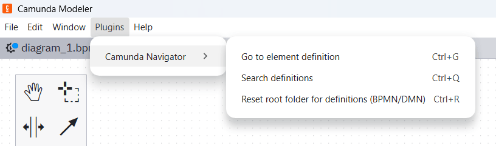

# Camunda Navigator

**Camunda Navigator** brings IDE-grade navigation to the Camunda Modeler. Stop hunting through folders—instantly jump between Call Activities, Business Rule Tasks, and global definitions.

## 🚀 Features

*   **Go to Definition:** Instantly open the linked BPMN/DMN file of a selected element.
*   **Global Search:** A powerful auto-complete modal to find and open any definition in your project.
*   **Smart Project Mapping:** Select your project root once; the plugin handles the rest by indexing your files.
*   **Menu Integration:** Access all actions via the native Modeler menu bar.

---

## 🔧 Installation

1.  **Download** the plugin repository.
2.  **Extract** the folder into your Camunda Modeler plugins directory:
    *   **Windows:** `%AppData%\camunda-modeler\resources\plugins`
    *   **macOS:** `~/Library/Application Support/camunda-modeler/resources/plugins`
    *   **Linux:** `~/.config/camunda-modeler/resources/plugins`
3.  **Restart** Camunda Modeler.

---

## 📖 How to Use

### ⌨️ Shortcuts

The plugin supports both Windows/Linux and macOS natively.

| Action | Windows/Linux | macOS | Description |
| :--- | :--- | :--- | :--- |
| **Go to Definition** | `Ctrl + G` | `Cmd + G` | Opens the file linked to the selected task. |
| **Search Definitions** | `Ctrl + Q` | `Cmd + Q` | Opens the auto-complete search modal. |
| **Reset Root Folder** | `Ctrl + R` | `Cmd + R` | Clears the saved path to select a new project. |

### 🛠 Initial Setup
The first time you trigger a command, the plugin will ask you to select your **Root Folder**. Choose the folder where your project's `.bpmn` and `.dmn` files are stored. The plugin uses this path to resolve `calledElement` and `decisionRef` attributes.

### 🔍 Navigating Call Activities
1. Select a **Call Activity** or **Business Rule Task**.
2. Press `Cmd/Ctrl + G`.
3. If the definition exists in your root folder, it opens automatically in a new window.

### ⚡ Quick Search
1. Press `Cmd/Ctrl + Q`.
2. Start typing the name of any process or decision.
3. Use arrow keys to select and hit **Enter** to open.

### 📂 Menu Access
A new **"Navigator"** menu will appear in the Modeler toolbar, containing:
*   `Go to Definition`
*   `Search Definitions`
*   `Reset Definitions Folder`

---

## 🤝 Contributing
Contributions are welcome! If you encounter any bugs or have feature suggestions, please open an [Issue](https://github.com/momennemrat/camunda-navigator/issues).

---

## 👤 Author

**Moumen Alnemrat**
* **Email:** [momen.nemrat@gmail.com](mailto:momen.nemrat@gmail.com)
* **Website:** [alnemrat.com](https://www.alnemrat.com/)
* **GitHub:** [@momennemrat](https://github.com/momennemrat)

---

## 📄 License
[MIT](LICENSE)
